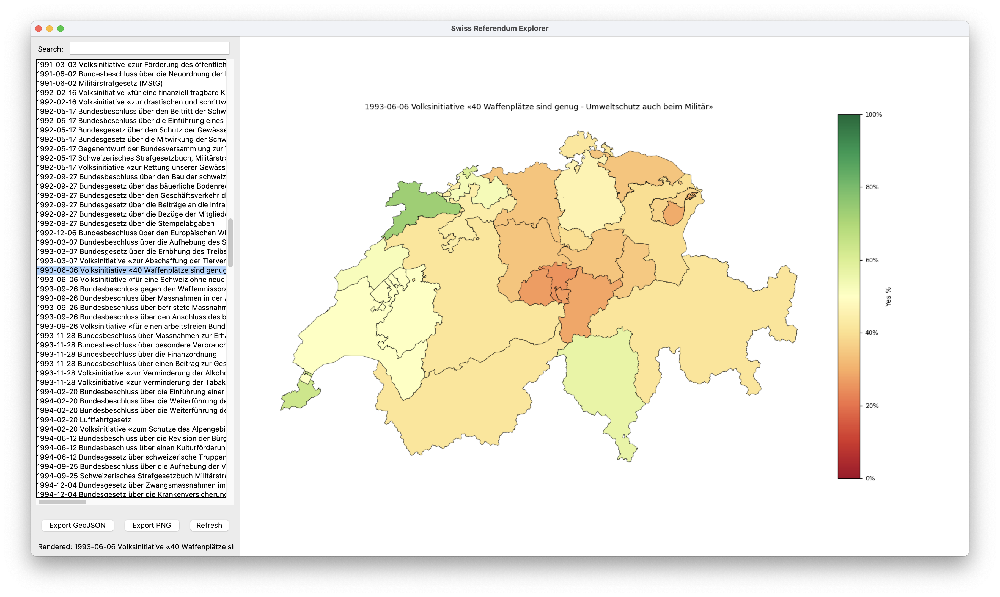

# Referendum Explorer

Interactive exploration of Swiss federal referendum results at the canton level.

The application loads the PC-Axis dataset (`volksabstimmungen.px`), normalizes multilingual canton names, aggregates vote counts, and renders an interactive Tkinter + Matplotlib choropleth map colored by percentage of YES votes per canton. Missing data can be fetched automatically (GUI prompt or CLI auto-download).



## Repository Structure

```
Data/                     # Downloaded PX + shapefiles (created on demand)
data_setup.py             # Automatic download + presence checks
Scripts/download_data.sh  # Legacy manual download script
main.py                   # Core aggregation + CLI
tk_app.py                 # Interactive GUI
Screenshot.png            # UI screenshot
README.md                 # This file
```

## Requirements

Python 3.10+, Core dependencies: pandas, geopandas, pyaxis, matplotlib, pyogrio.

Quick start:
```bash
python -m venv venv
source venv/bin/activate
pip install --upgrade pip
pip install pandas geopandas pyaxis matplotlib pyogrio
```

## Data Handling / Automatic Download

On first run we expect:
- `Data/volksabstimmungen.px`
- `Data/swissBOUNDARIES3D/swissBOUNDARIES3D_1_5_TLM_KANTONSGEBIET.shp`

If absent:
- GUI: prompts to download (PX + boundaries zip) from official sources.
- CLI: downloads automatically unless `--no-auto-download` is passed.

Manual alternative:
```bash
bash Scripts/download_data.sh
```

## Running the GUI

```bash
python tk_app.py
```

Features:
- Search box filters referendum titles instantly.
- Selection renders canton YES% choropleth (0–100, RdYlGn).
- Export GeoJSON (choose path) with YES/NO/TOTAL/YES_PCT.
- Export PNG (choose path, 200 DPI) of current figure.
- Refresh button invalidates cache for the selected title.

## Command-Line Usage

First referendum (auto export + plot):
```bash
python main.py
```

Filter by substring:
```bash
python main.py --filter "Abzockerei"
```

Select by index:
```bash
python main.py --index 42
```

Disable plot or export:
```bash
python main.py --no-draw --no-export
```

Disable auto-download:
```bash
python main.py --no-auto-download
```

## Missing Canton Recovery (Heuristic)

If a canton-level Ja/Nein pair is missing but subordinate rows exist, a heuristic (default on) sums Ja/Nein rows whose cleaned area name contains the first four accent‑stripped letters of the canton name. Pass `recover_missing=False` to `build_canton_votes` to require explicit canton rows only.

## Exported GeoJSON Fields

When present:
- `NAME`
- `YES`, `NO`, `TOTAL`, `YES_PCT`
- `geometry` (Polygon / MultiPolygon)